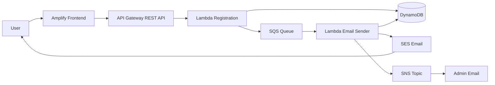

# DVA Serverless Project

Project này xây dựng một hệ thống đăng ký sự kiện theo kiến trúc serverless trên AWS. Người dùng điền form ở frontend, request được gửi qua API Gateway đến Lambda, dữ liệu được lưu vào DynamoDB, sau đó message được đẩy vào SQS để Lambda thứ hai xử lý gửi email cho user qua SES và thông báo cho admin qua SNS.

## Kiến Trúc



## AWS Services Sử Dụng

- **AWS Amplify**: host frontend đăng ký sự kiện.
- **API Gateway**: tạo REST API endpoint `/register`.
- **Lambda Registration**: validate request, ghi dữ liệu vào DynamoDB và gửi message vào SQS.
- **DynamoDB**: lưu thông tin đăng ký.
- **SQS**: queue trung gian cho luồng gửi email.
- **Lambda Email Sender**: đọc message từ SQS, gửi email, publish SNS và cập nhật trạng thái.
- **SES**: gửi email xác nhận cho user.
- **SNS**: gửi thông báo đăng ký mới cho admin.
- **IAM**: phân quyền cho các Lambda function.
- **GitHub**: lưu source frontend để Amplify deploy.

## Resource Naming

| Resource | Name |
|---|---|
| DynamoDB table | `d-dva-ddb-registration` |
| SQS queue | `d-dva-sqs-email` |
| SNS topic | `d-dva-sns-notification` |
| Lambda registration | `d-dva-lambda-registration` |
| Lambda sender | `d-dva-lambda-sender` |
| API Gateway | `d-dva-apigw-registration` |
| IAM policy registration | `d-dva-policy-for-lambda-registration` |
| IAM role registration | `d-dva-role-for-lambda-registration` |
| IAM policy sender | `d-dva-policy-for-lambda-sender` |
| IAM role sender | `d-dva-role-for-lambda-sender` |
| Frontend repository | `dva-serverless-project-frontend` |

Region mặc định trong workbook là `us-east-1`.

## Luồng Xử Lý

1. User submit form đăng ký từ frontend.
2. Frontend gọi API Gateway endpoint `/register`.
3. API Gateway chuyển request đến `d-dva-lambda-registration`.
4. Lambda Registration validate các field `first_name`, `last_name`, `email`.
5. Lambda tạo `id`, set trạng thái ban đầu là `QUEUED`, ghi item vào DynamoDB.
6. Lambda gửi message chứa thông tin đăng ký vào SQS.
7. SQS trigger `d-dva-lambda-sender`.
8. Lambda Email Sender gửi email xác nhận cho user qua SES.
9. Lambda publish thông báo đăng ký mới đến SNS topic cho admin.
10. Lambda cập nhật trạng thái record trong DynamoDB thành `SENT`.

## Prerequisites

- AWS account.
- Quyền tạo IAM Role, IAM Policy, Lambda, API Gateway, DynamoDB, SQS, SNS, SES và Amplify.
- Domain hoặc email đã verify trong SES.
- GitHub account để lưu frontend source.
- AWS region: `us-east-1`.

Nếu SES đang ở Sandbox mode, email người nhận cũng phải được verify. Có thể dùng `success@simulator.amazonses.com` để test.

## Cấu Trúc Project Đề Xuất

```text
dva-serverless-project/
├── frontend/
│   └── index.html
├── lambda-registration/
│   └── lambda_function.py
├── lambda-sender/
│   └── lambda_function.py
├── amplify.yml
└── README.md
```

## Environment Variables

### Lambda Registration

| Key | Value |
|---|---|
| `TABLE_NAME` | `d-dva-ddb-registration` |
| `QUEUE_URL` | Full SQS queue URL |
| `CORS_ORIGIN` | Frontend domain, hoặc `*` khi demo |
| `LOG_LEVEL` | `INFO` |

Ví dụ `QUEUE_URL`:

```text
https://sqs.us-east-1.amazonaws.com/<ACCOUNT_ID>/d-dva-sqs-email
```

### Lambda Email Sender

| Key | Value |
|---|---|
| `TABLE_NAME` | `d-dva-ddb-registration` |
| `TOPIC_ARN` | SNS topic ARN |
| `SES_SENDER` | Verified SES sender |
| `LOG_LEVEL` | `INFO` |

Ví dụ:

```text
TOPIC_ARN=arn:aws:sns:us-east-1:<ACCOUNT_ID>:d-dva-sns-notification
SES_SENDER=DVA Registration <no-reply@yourdomain.com>
```

### Amplify

| Key | Value |
|---|---|
| `API_URL` | API Gateway invoke URL của endpoint `/register` |

## Triển Khai

### 1. Tạo IAM Role Cho Lambda Registration

Tạo IAM policy cho phép:

- `dynamodb:PutItem` vào table `d-dva-ddb-registration`.
- `sqs:SendMessage` vào queue `d-dva-sqs-email`.
- Ghi log CloudWatch với `logs:CreateLogGroup`, `logs:CreateLogStream`, `logs:PutLogEvents`.

Sau đó tạo role `d-dva-role-for-lambda-registration` và attach policy này.

### 2. Tạo IAM Role Cho Lambda Email Sender

Tạo IAM policy cho phép:

- Đọc và xóa message từ SQS.
- Gửi email qua SES.
- Publish message vào SNS.
- Update item trong DynamoDB.
- Ghi log CloudWatch.

Sau đó tạo role `d-dva-role-for-lambda-sender` và attach policy này.

### 3. Tạo DynamoDB

Tạo table:

- Table name: `d-dva-ddb-registration`
- Partition key: `id`
- Type: `String`

### 4. Cấu Hình SES

Tạo SES identity cho domain hoặc email address. Nếu dùng domain, cần cấu hình DNS record theo hướng dẫn của SES.

Lưu ý: khi SES còn ở Sandbox mode, cả sender và recipient đều cần được verify.

### 5. Tạo SNS

Tạo SNS topic:

```text
d-dva-sns-notification
```

Sau đó tạo subscription:

- Protocol: `Email`
- Endpoint: email admin

Admin cần confirm subscription qua email.

### 6. Tạo SQS

Tạo standard queue:

```text
d-dva-sqs-email
```

### 7. Tạo Lambda Registration

Tạo Lambda:

- Function name: `d-dva-lambda-registration`
- Runtime: Python 3.13
- Architecture: x86_64
- Role: `d-dva-role-for-lambda-registration`

Thêm environment variables:

```text
TABLE_NAME=d-dva-ddb-registration
QUEUE_URL=https://sqs.us-east-1.amazonaws.com/<ACCOUNT_ID>/d-dva-sqs-email
CORS_ORIGIN=*
LOG_LEVEL=INFO
```

Deploy code xử lý submit form, validate input, ghi DynamoDB và gửi message vào SQS.

### 8. Tạo Lambda Email Sender

Tạo Lambda:

- Function name: `d-dva-lambda-sender`
- Runtime: Python 3.13
- Architecture: x86_64
- Role: `d-dva-role-for-lambda-sender`

Thêm environment variables:

```text
TABLE_NAME=d-dva-ddb-registration
TOPIC_ARN=arn:aws:sns:us-east-1:<ACCOUNT_ID>:d-dva-sns-notification
SES_SENDER=DVA Registration <no-reply@yourdomain.com>
LOG_LEVEL=INFO
```

Thêm trigger từ SQS queue `d-dva-sqs-email`.

### 9. Tạo API Gateway

Tạo REST API:

- API name: `d-dva-apigw-registration`
- Endpoint type: Regional
- Resource: `/register`
- Method: `POST`
- Integration type: Lambda function
- Lambda proxy integration: enabled
- Lambda function: `d-dva-lambda-registration`

Enable CORS cho resource `/register`, sau đó deploy API với stage `dev`.

### 10. Tạo Frontend Repository

Tạo GitHub repository:

```text
dva-serverless-project-frontend
```

Thêm file `index.html` chứa form đăng ký. Trong file frontend, dùng placeholder:

```js
const API_URL = "%%API_URL%%";
```

Placeholder này sẽ được thay bằng API Gateway endpoint khi build trên Amplify.

### 11. Deploy Frontend Bằng Amplify

Kết nối Amplify với GitHub repository, chọn branch `master`, sau đó cấu hình build settings:

```yml
version: 1
frontend:
    phases:
        build:
            commands:
                - 'sed -i "s|%%API_URL%%|$API_URL|g" index.html'
    artifacts:
        baseDirectory: /
        files:
            - '**/*'
    cache:
        paths: []
```

Thêm environment variable trong Amplify:

```text
API_URL=<API_GATEWAY_ENDPOINT>/register
```

Sau đó review và deploy.

## Test

### Test API Gateway

Gửi request mẫu:

```json
{
  "first_name": "dva",
  "last_name": "serverless",
  "email": "your-verified-email@example.com"
}
```

Kết quả mong đợi:

- API trả về `200`.
- Response có registration `id`.
- DynamoDB có item mới với status `QUEUED` hoặc `SENT`.
- User nhận email xác nhận từ SES.
- Admin nhận notification từ SNS.

### Test Frontend

1. Mở URL Amplify sau khi deploy.
2. Nhập first name, last name và email đã verify trong SES.
3. Submit form.
4. Kiểm tra message thành công trên giao diện.
5. Kiểm tra email user, email admin và DynamoDB table.

## Troubleshooting

| Vấn đề | Cách kiểm tra |
|---|---|
| API bị CORS | Kiểm tra CORS ở API Gateway và `CORS_ORIGIN` trong Lambda |
| Không nhận email SES | Kiểm tra SES identity, Sandbox mode và email recipient đã verify chưa |
| SNS không gửi email | Kiểm tra subscription đã confirm chưa |
| Lambda Registration lỗi | Kiểm tra `TABLE_NAME`, `QUEUE_URL`, IAM permission và CloudWatch Logs |
| Lambda Sender không chạy | Kiểm tra SQS trigger, IAM permission và CloudWatch Logs |
| Frontend gọi sai API | Kiểm tra biến `API_URL` trong Amplify |

## Cleanup

Xóa resource theo thứ tự sau để tránh sót dependency:

1. Amplify app
2. GitHub repository
3. API Gateway
4. Lambda Email Sender
5. Lambda Registration
6. SQS queue
7. SNS topic và subscription
8. SES identity
9. DynamoDB table
10. IAM roles và policies

## Lưu Ý Bảo Mật

- Không commit AWS credentials vào repository.
- Không dùng `CORS_ORIGIN=*` cho production.
- IAM policy nên giới hạn đúng resource ARN thay vì cấp quyền rộng.
- SES sender domain nên được verify đầy đủ với DKIM/SPF.
- Với production, nên thêm DLQ, monitoring, alarm và retry policy rõ ràng.

