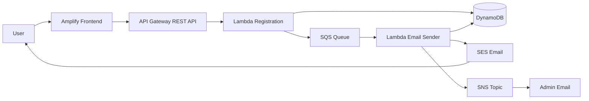

# AWS Serverless Event Registration System

This project demonstrates a fully serverless event registration workflow on AWS. A user submits a registration form from a static frontend hosted on AWS Amplify. The request is handled by API Gateway and Lambda, stored in DynamoDB, processed asynchronously with SQS, and then completed by sending email notifications through SES and SNS.

The project was originally built as an AWS Console based learning lab and can be extended later with Infrastructure as Code using AWS SAM, CDK, or Terraform.

## Architecture



## Features

- Static frontend hosted on AWS Amplify.
- REST API endpoint built with Amazon API Gateway.
- Serverless backend using AWS Lambda.
- Input validation for registration data.
- DynamoDB table for storing registration records.
- Asynchronous email processing with Amazon SQS.
- Email confirmation to users through Amazon SES.
- Admin notification through Amazon SNS.
- DynamoDB status update after email processing.
- IAM roles and policies scoped per Lambda function.
- Cleanup guide to avoid unnecessary AWS costs.

## Tech Stack

- **Frontend**: HTML, CSS, JavaScript, AWS Amplify
- **Backend**: AWS Lambda, Python 3.13
- **API**: Amazon API Gateway REST API
- **Database**: Amazon DynamoDB
- **Messaging**: Amazon SQS, Amazon SNS
- **Email**: Amazon SES
- **Security**: AWS IAM
- **Monitoring**: Amazon CloudWatch Logs

## Repository Structure

```text
aws-serverless-event-registration/
├── frontend/
│   └── index.html
├── lambdas/
│   ├── registration/
│   │   └── lambda_function.py
│   └── email-sender/
│       └── lambda_function.py
├── docs/
│   ├── architecture.png
│   └── screenshots/
├── amplify.yml
├── README.md
└── .gitignore
```

## How It Works

1. The user opens the Amplify-hosted frontend.
2. The user submits first name, last name, and email.
3. The frontend sends a `POST` request to API Gateway at `/register`.
4. API Gateway invokes the Registration Lambda.
5. The Registration Lambda validates the request body.
6. The Lambda creates a registration ID and stores the item in DynamoDB with status `QUEUED`.
7. The Lambda sends the registration payload to SQS.
8. SQS triggers the Email Sender Lambda.
9. The Email Sender Lambda sends a confirmation email to the user using SES.
10. The Lambda publishes an admin notification to SNS.
11. The Lambda updates the DynamoDB record status to `SENT`.

## AWS Resources

| Resource | Name |
|---|---|
| DynamoDB table | `d-dva-ddb-registration` |
| SQS queue | `d-dva-sqs-email` |
| SNS topic | `d-dva-sns-notification` |
| Registration Lambda | `d-dva-lambda-registration` |
| Email Sender Lambda | `d-dva-lambda-sender` |
| API Gateway | `d-dva-apigw-registration` |
| Registration IAM policy | `d-dva-policy-for-lambda-registration` |
| Registration IAM role | `d-dva-role-for-lambda-registration` |
| Sender IAM policy | `d-dva-policy-for-lambda-sender` |
| Sender IAM role | `d-dva-role-for-lambda-sender` |
| Frontend repository | `dva-serverless-project-frontend` |

Default region used in the lab:

```text
us-east-1
```

## Environment Variables

### Registration Lambda

| Key | Description | Example |
|---|---|---|
| `TABLE_NAME` | DynamoDB table name | `d-dva-ddb-registration` |
| `QUEUE_URL` | SQS queue URL | `https://sqs.us-east-1.amazonaws.com/<ACCOUNT_ID>/d-dva-sqs-email` |
| `CORS_ORIGIN` | Allowed frontend origin | `*` for demo |
| `LOG_LEVEL` | Logging level | `INFO` |

### Email Sender Lambda

| Key | Description | Example |
|---|---|---|
| `TABLE_NAME` | DynamoDB table name | `d-dva-ddb-registration` |
| `TOPIC_ARN` | SNS topic ARN | `arn:aws:sns:us-east-1:<ACCOUNT_ID>:d-dva-sns-notification` |
| `SES_SENDER` | Verified SES sender | `DVA Registration <no-reply@yourdomain.com>` |
| `LOG_LEVEL` | Logging level | `INFO` |

### Amplify

| Key | Description |
|---|---|
| `API_URL` | API Gateway invoke URL for the `/register` endpoint |

## Deployment Guide

### 1. Create IAM for the Registration Lambda

Create an IAM policy that allows the Registration Lambda to:

- Put items into the DynamoDB table.
- Send messages to the SQS queue.
- Write logs to CloudWatch.

Attach the policy to the IAM role:

```text
d-dva-role-for-lambda-registration
```

### 2. Create IAM for the Email Sender Lambda

Create an IAM policy that allows the Email Sender Lambda to:

- Receive, delete, and manage messages from SQS.
- Send emails through SES.
- Publish messages to SNS.
- Update items in DynamoDB.
- Write logs to CloudWatch.

Attach the policy to the IAM role:

```text
d-dva-role-for-lambda-sender
```

### 3. Create DynamoDB Table

Create a DynamoDB table with the following settings:

```text
Table name: d-dva-ddb-registration
Partition key: id
Partition key type: String
```

### 4. Configure SES

Create an SES identity for either:

- A domain, or
- An email address.

If SES is still in Sandbox mode, both sender and recipient email addresses must be verified. For testing, you can also use the SES mailbox simulator:

```text
success@simulator.amazonses.com
```

### 5. Create SNS Topic

Create a standard SNS topic:

```text
d-dva-sns-notification
```

Then create an email subscription for the admin email address. The subscription must be confirmed from the email inbox.

### 6. Create SQS Queue

Create a standard SQS queue:

```text
d-dva-sqs-email
```

### 7. Create Registration Lambda

Create a Lambda function:

```text
Function name: d-dva-lambda-registration
Runtime: Python 3.13
Architecture: x86_64
IAM role: d-dva-role-for-lambda-registration
```

Set environment variables:

```text
TABLE_NAME=d-dva-ddb-registration
QUEUE_URL=https://sqs.us-east-1.amazonaws.com/<ACCOUNT_ID>/d-dva-sqs-email
CORS_ORIGIN=*
LOG_LEVEL=INFO
```

Deploy the Lambda code that validates the request, writes to DynamoDB, and sends a message to SQS.

### 8. Create Email Sender Lambda

Create a Lambda function:

```text
Function name: d-dva-lambda-sender
Runtime: Python 3.13
Architecture: x86_64
IAM role: d-dva-role-for-lambda-sender
```

Set environment variables:

```text
TABLE_NAME=d-dva-ddb-registration
TOPIC_ARN=arn:aws:sns:us-east-1:<ACCOUNT_ID>:d-dva-sns-notification
SES_SENDER=DVA Registration <no-reply@yourdomain.com>
LOG_LEVEL=INFO
```

Add the SQS queue `d-dva-sqs-email` as a trigger.

### 9. Create API Gateway

Create a REST API:

```text
API name: d-dva-apigw-registration
Resource: /register
Method: POST
Integration type: Lambda function
Lambda proxy integration: enabled
Lambda function: d-dva-lambda-registration
Stage: dev
```

Enable CORS for the `/register` resource and deploy the API.

### 10. Deploy Frontend with Amplify

Create a GitHub repository for the frontend:

```text
dva-serverless-project-frontend
```

The frontend should contain a placeholder for the API endpoint:

```js
const API_URL = "%%API_URL%%";
```

Use this `amplify.yml` file:

```yml
version: 1
frontend:
  phases:
    build:
      commands:
        - 'sed -i "s|%%API_URL%%|$API_URL|g" index.html'
  artifacts:
    baseDirectory: /
    files:
      - '**/*'
  cache:
    paths: []
```

Add the Amplify environment variable:

```text
API_URL=<API_GATEWAY_INVOKE_URL>/register
```

Then review and deploy the Amplify app.

## API Test

Example request body:

```json
{
  "first_name": "dva",
  "last_name": "serverless",
  "email": "your-verified-email@example.com"
}
```

Expected result:

- API Gateway returns HTTP `200`.
- Response contains a registration ID.
- DynamoDB contains a new registration item.
- SQS receives and processes the message.
- The user receives a confirmation email from SES.
- The admin receives a notification from SNS.
- DynamoDB status is updated to `SENT`.

## Demo Checklist

For a stronger GitHub portfolio demo, include screenshots under `docs/screenshots/`:

- Frontend registration form.
- Successful frontend submission.
- API Gateway `/register` endpoint.
- DynamoDB item after submission.
- SQS trigger attached to the Email Sender Lambda.
- SES confirmation email.
- SNS admin notification email.
- CloudWatch logs for both Lambda functions.

## Troubleshooting

| Issue | What to Check |
|---|---|
| CORS error from frontend | API Gateway CORS settings and `CORS_ORIGIN` |
| SES email not received | SES identity verification and Sandbox mode |
| SNS email not received | SNS subscription confirmation |
| Registration Lambda fails | `TABLE_NAME`, `QUEUE_URL`, IAM permissions, CloudWatch Logs |
| Sender Lambda does not run | SQS trigger, IAM permissions, CloudWatch Logs |
| Frontend calls wrong endpoint | Amplify `API_URL` environment variable |
| DynamoDB status is not updated | Sender Lambda logs and `dynamodb:UpdateItem` permission |

## Cleanup

Delete resources in this order to avoid dependency issues and unnecessary costs:

1. Amplify app
2. GitHub repository
3. API Gateway
4. Email Sender Lambda
5. Registration Lambda
6. SQS queue
7. SNS topic and subscriptions
8. SES identities
9. DynamoDB table
10. IAM roles and policies

## Security Notes

- Do not commit AWS credentials to the repository.
- Do not expose real AWS account IDs or private endpoints in public screenshots.
- Avoid using `CORS_ORIGIN=*` in production.
- Use least-privilege IAM policies.
- Verify SES domain identity with proper DKIM/SPF configuration.
- Use CloudWatch Logs for debugging and auditing.

## Future Improvements

- Convert manual AWS Console steps to Infrastructure as Code with AWS SAM, CDK, or Terraform.
- Add a dead-letter queue for failed email processing.
- Add CloudWatch alarms for Lambda errors and SQS queue depth.
- Add request schema validation at API Gateway.
- Add custom domain support for the frontend and API.
- Add CI/CD deployment for Lambda and frontend updates.
- Add unit tests for Lambda validation logic.

